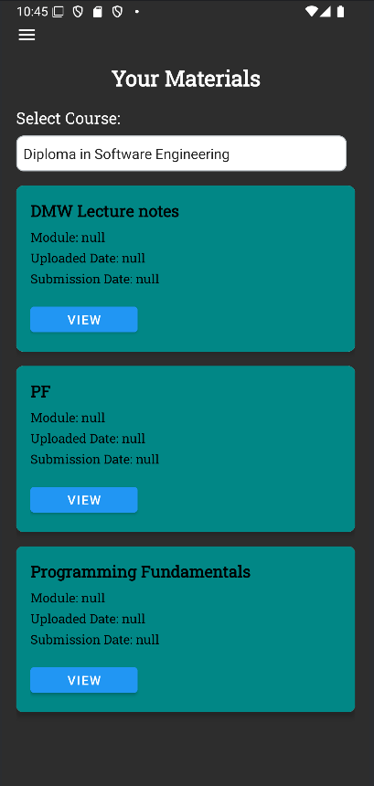

# Smart-Tuition-Management-Application

A Tuition Management Application for users Admin, Teacher/Lecturer, Student.

LinkedIn post link - https://www.linkedin.com/posts/damian-kenny-3a1a6534b_androiddevelopment-firebase-mobileappdevelopment-activity-7351810516014485504-XlM2?utm_source=share&utm_medium=member_ios&rcm=ACoAAFTExsgBxRUn757kbkaJCHrStwylC3h8tQ4

This application was made for my Mobile Application Development Coursework at my University.
The application is made for 3 users Admin, Teacher and Student, it is made for convenience for universities specially when it comes for student attendance which takes quite a while to properly check.

App Features:

Admin Features:

- Register and manage student/teacher accounts
- Assign students to teachers/courses
- View reports (attendance, results)

Teacher Features:

- Take student attendance via QR code
- Upload assignments and release results
- Upload and manage course materials

Student features:

- View attendance, assignments, and results
- Submit assignments
- View course materials
- Receive notifications from teachers/admin
- View branch location from App via Google maps location tracking

Admin Dashboard:

Teacher Dashboard:

Student Dashboard:

